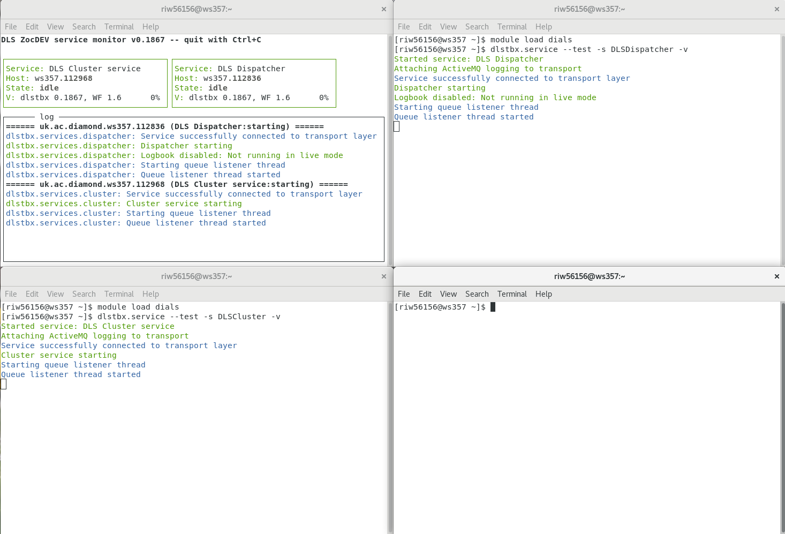

===========================
Getting started with Zocalo
===========================

Some Explanations
=================

The goal of Zocalo is to provide the capability and tools for creating and supporting automated data analysis work, particularly in combination with ISpyB.

In the past, attempts at this were difficult to debug as tasks could not be easily tracked down and analysis pipelines were prone to being run repeatedly in their entirety because just one stage had failed.

Zocalo provides key tools to monitor requests and interrogate jobs which were not processed correctly or went wrong.

It fits into the Diamond computing infrastructure where jobs are run on clusters without having to worry about which particular machine is being used.

Key Concepts
============

- Recipe - a specification for a data analysis pipeline
        It specifies what action is to be taken on which data and in which order with nodes.
        It can specify conditional pathways and trigger a wide variety of processes.
        Recipes are usually created with recipe templates which are then instantiated with relevant information at runtime - this allows one recipe to be used many times for different users/experiments.
        Once instantiated, the complete recipe will be passed from node to node along with information about what node is currently being computed and other useful information.
        This means that any machine can look at the recipe at any point and know what to do with it.
- Service - a process which runs continuously and waits for work.
        Services are constantly waiting until a message arrives so that they can do some work.
        There are often many instances of the same service running at the same time.
        Sometimes they are all waiting for work, sometimes there is too much work for them so some has to wait, and sometimes the amount of work is just right.
        Zocalo services are based on the Python Workflows CommonService class, which provides the code for listening out for Zocalo recipes on the queue and sending back output for the next node.
- Jobs - a process which runs only when it is needed
        Generally a bit more lightweight than a service, as it may have to be started many times.
        Zocalo jobs are wrapped with the Python Zocalo wrapper which allows them to interface with Zocalo recipes.
        A Zocalo job is not necessarily a cluster job, but it can be.

Writing A Recipe
================

Recipes are stored as `json files <https://beginnersbook.com/2015/04/json-tutorial/>`_.
There is a specific way of writing them so that they can be understood by both humans and computers.

Below is a simple recipe which writes "I am a recipe" to the file *recipe_out.txt*

Copy it to a text editor, change the *workingdir* and save it as *recipe_1.json*

.. code-block:: json

  {
    "1": { "service": "DLS cluster submission",
           "queue": "cluster.submission",
           "parameters": { "cluster": "cluster",
                           "cluster_submission_parameters": "-N demo -q medium.q -pe smp 1 -l h_rt=00:01:00",
                           "cluster_project": "dls",
                           "cluster_commands": [
  "echo 'I am a recipe' > recipe_out.txt"
                           ],
                           "workingdir": "/dls/tmp/your_fedid/zocalo"
                         }
         },
    "start": [
        [1, []]
    ]
  }

.. note::
  Change the file path on "workingdir" from *"/dls/tmp/your_fedid/zocalo"* to a temporary folder you can write to

Running The Recipe
------------------

Running recipes is a bit more complicated than a normal program, but is set up so that you can see everything happen when developing.
You will need 4 terminals open.
They will all use the DIALS environment so either load the dials module or activate it from your local copy in each terminal.

Terminal #1
^^^^^^^^^^^

Run the status monitor. This is a tool to show you what is running in your test space.

.. code-block::

  module load dials; dlstbx.status_monitor --test

Terminal #2
^^^^^^^^^^^

Start the DLS Dispatcher service, which reads recipes and sends them on to other services to be processed.

.. code-block::

  module load dials; dlstbx.service --test -s DLSDispatcher -v

Terminal #3
^^^^^^^^^^^

Start your DLS Cluster service, which will run commands on the cluster.
In this case, it will write our file.

.. code-block::

  module load dials; dlstbx.service --test -s DLSCluster -v

Terminal #4
^^^^^^^^^^^

By now, your screen should look something like this:

Finally, lets run the recipe.
Go to the directory you saved the file in, or provide a full filepath:

.. code-block::

  module load dials; dlstbx.go --test -f recipe.json 1234

.. note::
  The *1234* is a **Data Collection ID** number which is often used at Diamond.
  Basically the recipe expects a number, even though we aren't using it.

This should have prompted some output in your terminals, particularly on the terminal with the DLS Dispatcher service running.

And, if you go to the *workingdir* you specified in the recipe, you should find *recipe_out.txt* with some writing in it!

If this didn't happen, go back and copy things exactly as they are written here.
Make sure you haven't added spaces or speech marks or commas, or deleted any of these things.

Moving on
---------

The next tutorial will cover how to use variables in your recipe, including ISPyB variables which are provided by default.
