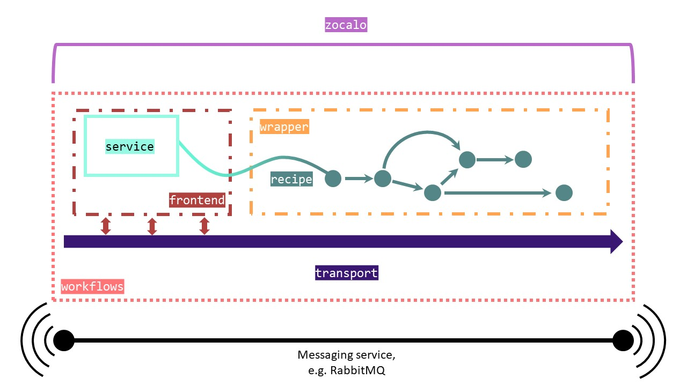
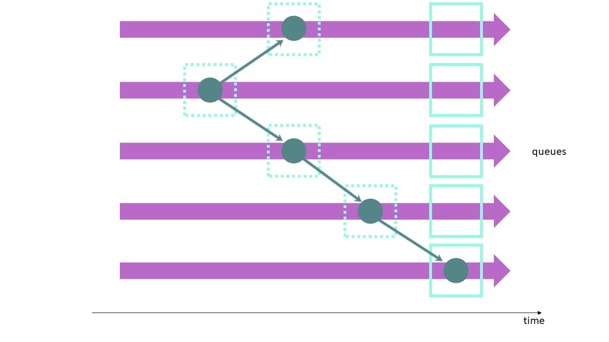

=========
Workflows 
=========

Zocalo is built on top of the `python-workflows` package. This provides the facilities with which services and recipes for Zocalo are constructed. 

``python-workflows`` interfaces directly with an externally provided client library for a message broker such as ActiveMQ or RabbitMQ through its ``transport`` module. Services then take messages, process them, and maybe produce some output. The outputs of services can be piped together through a recipe. Services can also be used to monitor message queues. ``python-zocalo`` runs ``python-workflows`` services and recipes, wrapping them so that they are all visible to Zocalo.

This diagram illustrates the overall task management model of Zocalo. Services run continuously, consuming from the relevant queues. Recipes inside of wrappers dictate the flow of data from queue to queue and, therefore, from service to service. The nodes represent input data which is given to the service with the output of a service becoming the input for the next.
