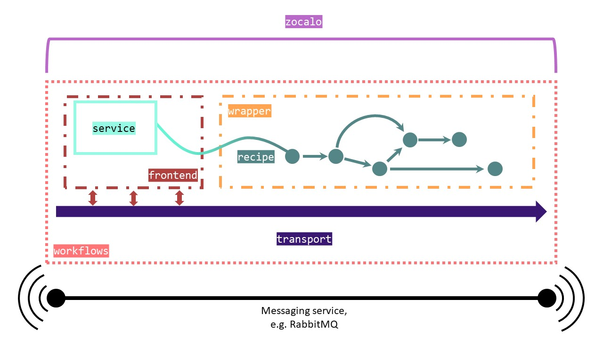
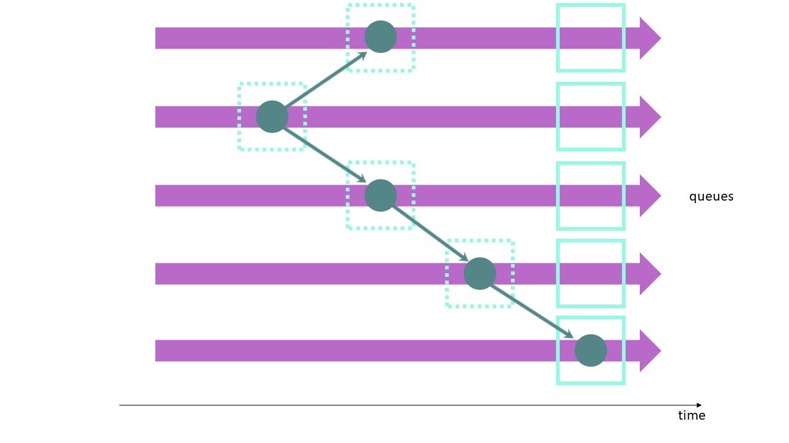

# Zocalo

Zocalo is an automated data processing system designed at Diamond Light Source.

The idea of Zocalo is a simple one - to build a messaging framework, where text-based messages are sent between parts of the system to coordinate data analysis. In the wider scope of things this also covers things like archiving, but generally it is handling everything that happens after data aquisition.

Zocalo as a wider whole is made up of two repositories (plus some private internal repositories when deployed at Diamond):

- **[DiamondLightSource/python-zocalo]** - Infrastructure components for automated data processing, developed by Diamond Light Source. The package is available through [PyPi][PyPi-zoc] and [conda-forge][conda-forge-zoc]. 
- **[DiamondLightSource/python-workflows]** - Zocalo is built on the workflows package. It shouldn't be necessary to interact too much with this package, as the details are abstracted by Zocalo. workflows controls the logic of how services connect to each other and what a service is, and actually send the messages to a message broker. Currently this is an [ActiveMQ] broker (via [STOMP]) but support for a [RabbitMQ] broker (via [pika]) is being added. Also on [PyPi][PyPi-wf] and [conda-forge][conda-forge-wf].

As mentioned, Zocalo is currently built on top of ActiveMQ. ActiveMQ is an apache project that provides a [message broker] server, acting as a central dispatch that allows various services to communicate. Messages are plaintext, but from the Zocalo point of view it's passing aroung python objects (json dictionaries). Every message sent has a destination to help the message broker route. Messages may either be sent to a specific queue or broadcast to multiple queues. These queues are subscribed to by the services that run in Zocalo. In developing with Zocalo, you may have to interact with ActiveMQ or RabbitMQ, but it is unlikely that you will have to configure it.

Zocalo allows for the monitoring of jobs executing `python-workflows` services or recipe wrappers. The `python-workflows` package contains most of the infrastructure required for the jobs themselves and more detailed documentation of its components can be found [here](https://github.com/DiamondLightSource/python-workflows/). These components are schematically represented below.



`python-workflows` interfaces directly with an externally provided client library for a message broker such as ActiveMQ or RabbitMQ through its `transport` module. Services then take messages, process them, and maybe produce some output. The outputs of services can be piped together through a recipe. Services can also be used to monitor message queues. `python-zocalo` runs `python-workflows` services and recipes, wrapping them so that they are all visible to Zocalo.

[DiamondLightSource/python-zocalo]: https://github.com/DiamondLightSource/python-zocalo
[DiamondLightSource/python-workflows]: https://github.com/DiamondLightSource/python-workflows/
[RabbitMQ]: https://www.rabbitmq.com/
[STOMP]: https://stomp.github.io/
[pika]: https://github.com/pika/pika
[PyPi-zoc]: https://pypi.org/project/zocalo/
[conda-forge-zoc]: https://anaconda.org/conda-forge/zocalo
[PyPi-wf]: https://pypi.org/project/workflows/
[conda-forge-wf]: https://anaconda.org/conda-forge/workflows
[github/dlstbx]: https://github.com/DiamondLightSource/python-dlstbx
[gitlab/zocalo]: https://gitlab.diamond.ac.uk/scisoft/zocalo
[ActiveMQ]: http://activemq.apache.org/
[DIALS]: https://dials.github.io/
[message broker]: https://en.wikipedia.org/wiki/Message_broker

## Core Concepts

There are two kinds of task run in Zocalo: _services_ and _wrappers_.
A service should handle a discrete short-lived task, for example a data processing job on a small data packet (e.g. finding spots on a single image in an X-ray crystallography context), or inserting results into a database.
In contrast, wrappers can be used for longer running tasks, for example running data processing programs such as [xia2](https://xia2.github.io/) or [fast_ep](https://github.com/DiamondLightSource/fast_ep).
- A **service** starts in the background and waits for work. There are many services constantly running as part of normal Zocalo operation. In typical usage at Diamond there are ~100 services running at a time.
- A **wrapper** on the other hand, is only run when needed. They wrap something that is not necessarily aware of Zocalo - e.g. downstream processing software such as xia2 have no idea what zocalo is, and shouldn't have to. A wrapper takes a message, converts to the instantiation of command line, runs the software - typically as a cluster job, then reformats the results into a message to send back to Zocalo. These processes have no idea what Zocalo is, but are being run by a script that handles the wrapping.

At Diamond, everything goes to one service to start with: the **Dispatcher**. This takes the initial request message and attaches useful information for the rest of Zocalo. The implementation of the Dispatcher at Diamond is environment specific and not public, but it does some things that would be useful for a similar service to do in other contexts. At Diamond there is interaction with the [ISPyB database](https://github.com/DiamondLightSource/ispyb-database) that stores information about what is run, metadata, how many images, sample type etc. Data stored in the database influences what software we want to be running and this information might need to be read from the database in many, many services. We obviously don't want to read the same thing from many clients and flood the database, and don't want the database to be a single point of failure. The dispatcher front-loads all the database operations - it takes the data collection ID (DCID) and looks up in ISPyB all the information that could be needed for processing. In terms of movement through the system, it sits between the initial message and the services:

```
message -> Dispatcher -> [Services]
```
At end of processing there might be information that needs to go back into the databases, for which Diamond has a special ISPyB service to do the writing. If the DB goes down, that is fine - things will queue up for the ISPyB service and get processed when the database becomes available again, and written to the database when ready. This isolates us somewhat from intermittent failures.



This diagram illustrates the overall task management model of Zocalo. Services run continuosly, consuming from the relevant queues. Recipes inside of wrappers dictate the flow of data from queue to queue and, therefore, from service to service. The nodes represent input data which is given to the service with the output of a service becoming the input for the next.

The only public Zocalo service at present is `Schlockmeister`, a garbage collection service that removes jobs that have been requeued mutliple times. Diamond operates a variety of internal Zocalo services which perform frequently required operations in a data analysis pipeline.

## Working with Zocalo

[Graylog](https://www.graylog.org/) is used to manage the logs produced by Zocalo. Once Graylog and the message broker server are running then services and wrappers can be launched with Zocalo. 

Zocalo provides some command line tools. These tools are `zocalo.go`, `zocalo.wrap` and `zocalo.service`: the first triggers the processing of a recipe and the second runs a command while exposing its status to Zocalo so that it can be tracked. Services are available through `zocalo.service` if they are linked through the `workflows.services` entry point in `setup.py`. For example, to start a Schlockmeister service:

```bash
$ zocalo.service -s Schlockmeister
```

| Q: How are services started?
| ---
| A: Zocalo itself is agnostic on this point. Some of the services are self-propagating and employ simple scaling behaviour - in particular the per-image-analysis services. The services in general all run on cluster nodes, although this means that they can not be long lived - beyond a couple of hours there is a high risk of the service cluster jobs being terminated or pre-empted. This also helps encourage programming more robust services if they could be killed.

| Q: So if a service is terminated in the middle of processing it will still get processed?
| ---
| A: Yes, messages are handled in transactions - while a service is processing a message, it's marked as "in-progress" but isn't completely dropped. If the service doesn't process the message, or it's connection to ActiveMQ gets dropped, then it get's requeued so that another instance of the service can pick it up.

## Repeat Message Failure

How are repeat errors handled? This is a problem with the system - if e.g. an image or malformed message kills a service then it will get requeued, and will eventually kill all instances of the service running (which will get re-spawned, and then die, and so forth).

We have a special service that looks for repeat failures and moves them to a special "Dead Letter Queue". This service is called **[Schlockmeister]**, and is the only service at time of writing that has migrated to the public zocalo repository. This service looks inside the message that got sent, extracts some basic information from the message in as safe a way as possible and repackages to the DLQ with information on what it was working on, and the "history" of where the message chain has been routed.

[Schlockmeister]: https://github.com/DiamondLightSource/python-zocalo/tree/master/zocalo/service